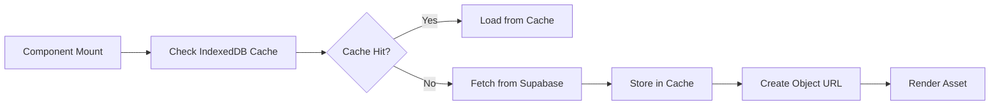
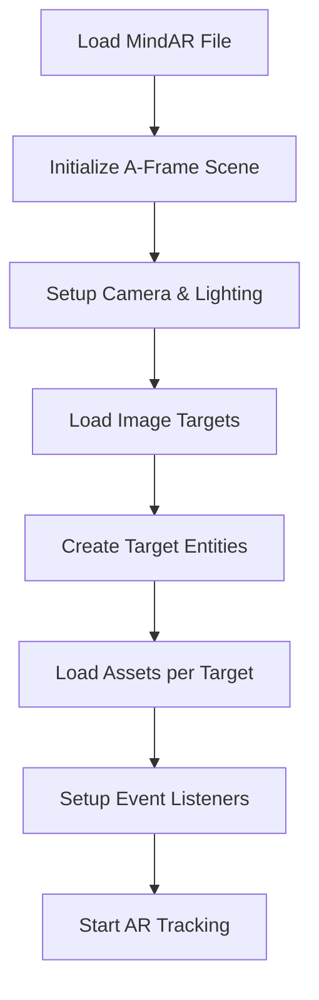
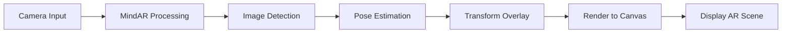

# สถาปัตยกรรมระบบ WeMeAr

## ภาพรวมสถาปัตยกรรม

WeMeAr เป็นแอปพลิเคชัน Augmented Reality ที่ใช้สถาปัตยกรรมแบบ Client-Side Rendering โดยสมบูรณ์ ทำงานบนเบราว์เซอร์ของผู้ใช้โดยไม่ต้องใช้ server-side processing สำหรับการ render AR

```
┌─────────────────────────────────────────────────────────────────┐
│                        Browser/Client                           │
├─────────────────────────────────────────────────────────────────┤
│  ┌─────────────┐  ┌─────────────┐  ┌─────────────┐             │
│  │   React     │  │  MindAR +   │  │  A-Frame +  │             │
│  │ Components  │  │  Image      │  │  Three.js   │             │
│  │             │  │  Tracking   │  │             │             │
│  └─────────────┘  └─────────────┘  └─────────────┘             │
├─────────────────────────────────────────────────────────────────┤
│  ┌─────────────┐  ┌─────────────┐  ┌─────────────┐             │
│  │ TensorFlow  │  │  MediaPipe  │  │  Asset      │             │
│  │    .js       │  │   Tasks     │  │  Caching    │             │
│  └─────────────┘  └─────────────┘  └─────────────┘             │
├─────────────────────────────────────────────────────────────────┤
│  ┌─────────────┐  ┌─────────────┐  ┌─────────────┐             │
│  │   Camera    │  │  WebGL /    │  │  Canvas     │             │
│  │   Access    │  │  WebRTC     │  │  Rendering  │             │
│  └─────────────┘  └─────────────┘  └─────────────┘             │
└─────────────────────────────────────────────────────────────────┘
                     ▲
                     │
            ┌──────────────────┐
            │     Supabase     │
            │   (External)     │
            └──────────────────┘
```

## Data Flow

### 1. Asset Loading


### 2. AR Scene Creation


### 3. Real-time Processing


## Component Architecture

### Core Components

#### 1. TestArMind2.jsx (Main AR Component)
**หน้าที่**: จัดการ lifecycle ของ AR scene และ coordinate ระหว่าง MindAR กับ A-Frame

**Key Methods**:
- `waitForMindAR()`: รอให้ MindAR library โหลดเสร็จ
- `initAR()`: สร้างและกำหนดค่า AR scene
- Asset loading และ caching
- Event handling สำหรับ AR states

#### 2. Asset Management (utils/idbAsset.js)
**หน้าที่**: จัดการการโหลดและ caching ของ assets

**Features**:
- IndexedDB สำหรับ persistent caching
- Blob URL management
- Memory cleanup

#### 3. Data Structure (make_data/make_mind_ar.js)
**หน้าที่**: กำหนดข้อมูลสำหรับ AR scenes

**Structure**:
```javascript
{
  id: "scene-id",
  "image tracking": {
    track1: [assets],
    track2: [assets]
  },
  mindFile: "target-file-url"
}
```

## Technology Integration

### MindAR + A-Frame Integration

MindAR ใช้สำหรับการติดตามภาพ ขณะที่ A-Frame ใช้สำหรับการ render 3D content การ integrate ทำผ่าน:

1. **Scene Creation**: สร้าง A-Frame scene ที่มี MindAR image target
2. **Entity Management**: สร้าง A-Frame entities สำหรับแต่ละ asset
3. **Coordinate System**: แปลง coordinate system ระหว่าง MindAR กับ A-Frame

### React Integration

React ใช้สำหรับจัดการ UI state และ lifecycle โดยที่ AR scene เป็น unmanaged component ที่ทำงานอิสระจาก React lifecycle

```javascript
// Pattern ที่ใช้
useEffect(() => {
  if (window.__MINDAR_INIT__) return; // ป้องกัน double init
  initAR(); // สร้าง AR scene
}, []);
```

## Performance Optimizations

### 1. Asset Caching Strategy
- **IndexedDB**: เก็บ assets ไว้ใน browser storage
- **Blob URLs**: สร้าง object URLs สำหรับ assets ที่ cache
- **Memory Management**: Revoke URLs เมื่อไม่ใช้งาน

### 2. Rendering Optimizations
- **WebGL Backend**: ใช้ GPU acceleration
- **Efficient Lighting**: ใช้ ambient + directional lights
- **Shadow Mapping**: สำหรับ 3D models ที่ต้องการ

### 3. Bundle Optimization
- **Vite**: Fast development และ optimized production builds
- **Tree Shaking**: ลดขนาด bundle โดยเอาเฉพาะ code ที่ใช้
- **Code Splitting**: แยก vendor libraries

## Security Considerations

### 1. HTTPS Requirement
- ต้องใช้ HTTPS สำหรับ camera access
- Mixed content จะถูก block โดย browser

### 2. CORS Policy
- Assets จาก external sources ต้องมี CORS headers
- Supabase storage ต้องกำหนด bucket policy

### 3. Privacy
- Camera access ขอ permission จาก user
- ไม่เก็บข้อมูลส่วนตัวโดยไม่จำเป็น

## Browser Compatibility

### Supported Browsers
- Chrome 88+
- Firefox 85+
- Safari 14+
- Edge 88+

### Web APIs ที่ใช้
- **MediaDevices.getUserMedia()**: Camera access
- **WebGL**: 3D rendering
- **IndexedDB**: Asset caching
- **WebRTC**: Real-time video processing

## Deployment Architecture

### Development
```bash
npm run dev
# ใช้ Vite dev server ที่ http://localhost:5173
# Hot reload สำหรับ development
```

### Production
```bash
npm run build
npm run preview
# Build ด้วย Vite optimization
# Preview production build
```

### Hosting Requirements
- **HTTPS**: ต้องมี SSL certificate
- **WebGL Support**: สำหรับ 3D rendering
- **Camera Permissions**: Browser security policies

## Monitoring & Debugging

### Development Tools
- Browser DevTools สำหรับ WebGL inspection
- React DevTools สำหรับ component debugging
- Network tab สำหรับ asset loading monitoring

### Performance Metrics
- Asset loading times
- Frame rates สำหรับ AR rendering
- Memory usage สำหรับ 3D assets

---

เอกสารนี้ช่วยให้เข้าใจสถาปัตยกรรมและการทำงานของระบบ WeMeAr ได้อย่างครอบคลุม เหมาะสำหรับนักพัฒนาที่ต้องการต่อยอดหรือ maintain โปรเจคนี้
